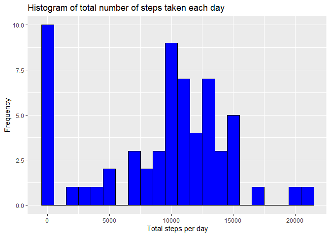
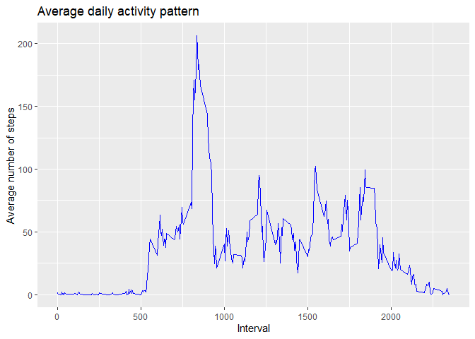
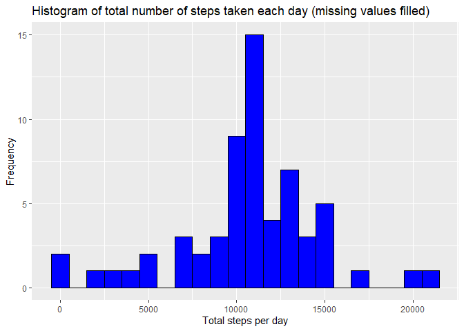
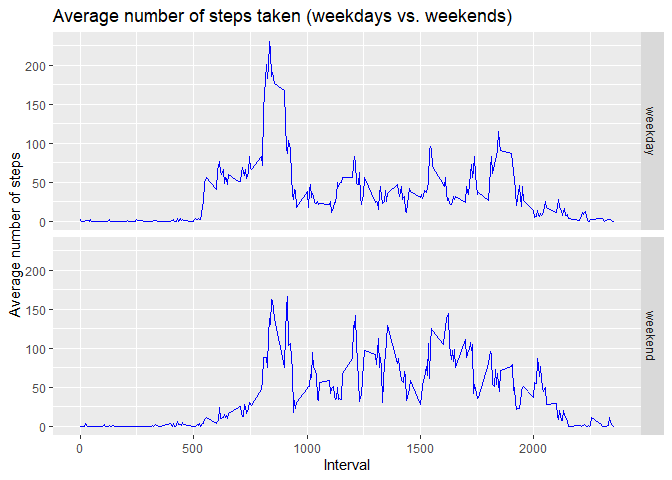

## Loading and preprocessing the data


```r
# Load the necessary libraries
library(dplyr)
```

```
## 
## Attaching package: 'dplyr'
```

```
## The following objects are masked from 'package:stats':
## 
##     filter, lag
```

```
## The following objects are masked from 'package:base':
## 
##     intersect, setdiff, setequal, union
```

```r
library(ggplot2)
```

```
## Warning: package 'ggplot2' was built under R version 4.2.3
```

```r
library(lubridate)
```

```
## Warning: package 'lubridate' was built under R version 4.2.3
```

```
## 
## Attaching package: 'lubridate'
```

```
## The following objects are masked from 'package:base':
## 
##     date, intersect, setdiff, union
```

```r
# Load the data
data <- read.csv("activity.csv")

# Process/transform the data (if necessary) into a format suitable for your analysis
data$date <- as.Date(data$date, format = "%Y-%m-%d")
```

## What is mean total number of steps taken per day?

```r
# Total number of steps taken per day
total_steps_per_day <- data %>%
  group_by(date) %>%
  summarize(total_steps = sum(steps, na.rm = TRUE))

# Histogram of the total number of steps taken each day
ggplot(total_steps_per_day, aes(total_steps)) +
  geom_histogram(binwidth = 1000, fill = "blue", color = "black") +
  xlab("Total steps per day") +
  ylab("Frequency") +
  ggtitle("Histogram of total number of steps taken each day")
```

<!-- -->

```r
# Mean and median of the total number of steps taken per day
mean_steps_per_day <- mean(total_steps_per_day$total_steps)
median_steps_per_day <- median(total_steps_per_day$total_steps)
```

## What is the average daily activity pattern?

```r
# Time series plot of the average number of steps taken
avg_steps <- data %>%
  group_by(interval) %>%
  summarize(avg_steps = mean(steps, na.rm = TRUE))

ggplot(avg_steps, aes(interval, avg_steps)) +
  geom_line(color = "blue") +
  xlab("Interval") +
  ylab("Average number of steps") +
  ggtitle("Average daily activity pattern")
```

<!-- -->

```r
# 5-minute interval containing the maximum number of steps
max_interval <- avg_steps[which.max(avg_steps$avg_steps), "interval"]
```

## Imputing missing values

```r
# Number of missing values
num_missing_values <- sum(is.na(data$steps))

# Strategy for filling in missing values
avg_steps_all <- function(interval) {
  avg_steps[avg_steps$interval == interval, ]$avg_steps
}

# Fill in missing values
data_filled <- data
missing_values <- is.na(data_filled$steps)
data_filled$steps[missing_values] <- sapply(data_filled$interval[missing_values], avg_steps_all)

# New dataset with missing data filled in
# Histogram of the total number of steps taken each day (missing values filled)
total_steps_per_day_filled <- data_filled %>%
  group_by(date) %>%
  summarize(total_steps = sum(steps))

ggplot(total_steps_per_day_filled, aes(total_steps)) +
  geom_histogram(binwidth = 1000, fill = "blue", color = "black") +
  xlab("Total steps per day") +
  ylab("Frequency") +
  ggtitle("Histogram of total number of steps taken each day (missing values filled)")
```

<!-- -->

```r
# New mean and median of the total number of steps taken per day (missing values filled)
mean_steps_per_day_filled <- mean(total_steps_per_day_filled$total_steps)
median_steps_per_day_filled <- median(total_steps_per_day_filled$total_steps)
```

## Are there differences in activity patterns between weekdays and weekends?


```r
# Create a new factor variable in the dataset indicating whether a given date is a weekday or weekend day
data_filled$day_type <- ifelse(weekdays(data_filled$date) %in% c("Saturday", "Sunday"), "weekend", "weekday")

# Make a panel plot containing a time series plot of the 5-minute interval and the average number of steps taken
avg_steps_daytype <- data_filled %>%
  group_by(interval, day_type) %>%
  summarize(avg_steps = mean(steps))
```

```
## `summarise()` has grouped output by 'interval'. You can override using the
## `.groups` argument.
```

```r
ggplot(avg_steps_daytype, aes(interval, avg_steps)) +
  geom_line(color = "blue") +
  facet_grid(day_type ~ .) +
  xlab("Interval") +
  ylab("Average number of steps") +
  ggtitle("Average number of steps taken (weekdays vs. weekends)")
```

<!-- -->
